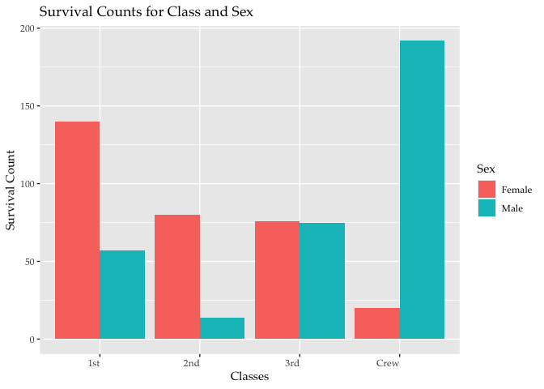
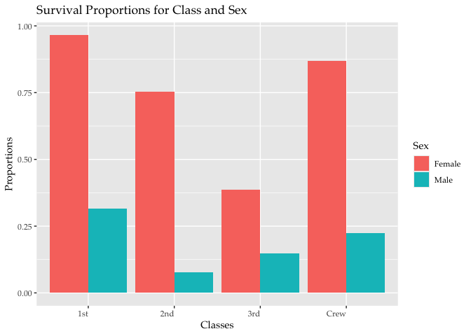
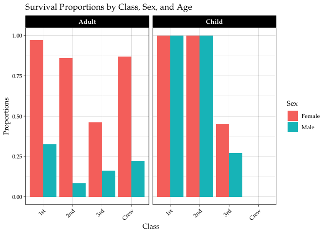

RMS Titanic
================
Dakota Chang
2025-01-30

- [Grading Rubric](#grading-rubric)
  - [Individual](#individual)
  - [Submission](#submission)
- [First Look](#first-look)
  - [**q1** Perform a glimpse of `df_titanic`. What variables are in
    this
    dataset?](#q1-perform-a-glimpse-of-df_titanic-what-variables-are-in-this-dataset)
  - [**q2** Skim the Wikipedia article on the RMS Titanic, and look for
    a total count of souls aboard. Compare against the total computed
    below. Are there any differences? Are those differences large or
    small? What might account for those
    differences?](#q2-skim-the-wikipedia-article-on-the-rms-titanic-and-look-for-a-total-count-of-souls-aboard-compare-against-the-total-computed-below-are-there-any-differences-are-those-differences-large-or-small-what-might-account-for-those-differences)
  - [**q3** Create a plot showing the count of persons who *did*
    survive, along with aesthetics for `Class` and `Sex`. Document your
    observations
    below.](#q3-create-a-plot-showing-the-count-of-persons-who-did-survive-along-with-aesthetics-for-class-and-sex-document-your-observations-below)
- [Deeper Look](#deeper-look)
  - [**q4** Replicate your visual from q3, but display `Prop` in place
    of `n`. Document your observations, and note any new/different
    observations you make in comparison with q3. Is there anything
    *fishy* in your
    plot?](#q4-replicate-your-visual-from-q3-but-display-prop-in-place-of-n-document-your-observations-and-note-any-newdifferent-observations-you-make-in-comparison-with-q3-is-there-anything-fishy-in-your-plot)
  - [**q5** Create a plot showing the group-proportion of occupants who
    *did* survive, along with aesthetics for `Class`, `Sex`, *and*
    `Age`. Document your observations
    below.](#q5-create-a-plot-showing-the-group-proportion-of-occupants-who-did-survive-along-with-aesthetics-for-class-sex-and-age-document-your-observations-below)
- [Notes](#notes)

*Purpose*: Most datasets have at least a few variables. Part of our task
in analyzing a dataset is to understand trends as they vary across these
different variables. Unless we’re careful and thorough, we can easily
miss these patterns. In this challenge you’ll analyze a dataset with a
small number of categorical variables and try to find differences among
the groups.

*Reading*: (Optional) [Wikipedia
article](https://en.wikipedia.org/wiki/RMS_Titanic) on the RMS Titanic.

<!-- include-rubric -->

# Grading Rubric

<!-- -------------------------------------------------- -->

Unlike exercises, **challenges will be graded**. The following rubrics
define how you will be graded, both on an individual and team basis.

## Individual

<!-- ------------------------- -->

| Category | Needs Improvement | Satisfactory |
|----|----|----|
| Effort | Some task **q**’s left unattempted | All task **q**’s attempted |
| Observed | Did not document observations, or observations incorrect | Documented correct observations based on analysis |
| Supported | Some observations not clearly supported by analysis | All observations clearly supported by analysis (table, graph, etc.) |
| Assessed | Observations include claims not supported by the data, or reflect a level of certainty not warranted by the data | Observations are appropriately qualified by the quality & relevance of the data and (in)conclusiveness of the support |
| Specified | Uses the phrase “more data are necessary” without clarification | Any statement that “more data are necessary” specifies which *specific* data are needed to answer what *specific* question |
| Code Styled | Violations of the [style guide](https://style.tidyverse.org/) hinder readability | Code sufficiently close to the [style guide](https://style.tidyverse.org/) |

## Submission

<!-- ------------------------- -->

Make sure to commit both the challenge report (`report.md` file) and
supporting files (`report_files/` folder) when you are done! Then submit
a link to Canvas. **Your Challenge submission is not complete without
all files uploaded to GitHub.**

``` r
library(tidyverse)
```

    ## ── Attaching core tidyverse packages ──────────────────────── tidyverse 2.0.0 ──
    ## ✔ dplyr     1.1.4     ✔ readr     2.1.5
    ## ✔ forcats   1.0.0     ✔ stringr   1.5.1
    ## ✔ ggplot2   3.5.1     ✔ tibble    3.2.1
    ## ✔ lubridate 1.9.3     ✔ tidyr     1.3.1
    ## ✔ purrr     1.0.2     
    ## ── Conflicts ────────────────────────────────────────── tidyverse_conflicts() ──
    ## ✖ dplyr::filter() masks stats::filter()
    ## ✖ dplyr::lag()    masks stats::lag()
    ## ℹ Use the conflicted package (<http://conflicted.r-lib.org/>) to force all conflicts to become errors

``` r
df_titanic <- as_tibble(Titanic)
```

*Background*: The RMS Titanic sank on its maiden voyage in 1912; about
67% of its passengers died.

# First Look

<!-- -------------------------------------------------- -->

### **q1** Perform a glimpse of `df_titanic`. What variables are in this dataset?

``` r
## TASK: Perform a `glimpse` of df_titanic
glimpse(df_titanic)
```

    ## Rows: 32
    ## Columns: 5
    ## $ Class    <chr> "1st", "2nd", "3rd", "Crew", "1st", "2nd", "3rd", "Crew", "1s…
    ## $ Sex      <chr> "Male", "Male", "Male", "Male", "Female", "Female", "Female",…
    ## $ Age      <chr> "Child", "Child", "Child", "Child", "Child", "Child", "Child"…
    ## $ Survived <chr> "No", "No", "No", "No", "No", "No", "No", "No", "No", "No", "…
    ## $ n        <dbl> 0, 0, 35, 0, 0, 0, 17, 0, 118, 154, 387, 670, 4, 13, 89, 3, 5…

``` r
## TASK: Perform a `glimpse` of df_titanic
df_titanic
```

    ## # A tibble: 32 × 5
    ##    Class Sex    Age   Survived     n
    ##    <chr> <chr>  <chr> <chr>    <dbl>
    ##  1 1st   Male   Child No           0
    ##  2 2nd   Male   Child No           0
    ##  3 3rd   Male   Child No          35
    ##  4 Crew  Male   Child No           0
    ##  5 1st   Female Child No           0
    ##  6 2nd   Female Child No           0
    ##  7 3rd   Female Child No          17
    ##  8 Crew  Female Child No           0
    ##  9 1st   Male   Adult No         118
    ## 10 2nd   Male   Adult No         154
    ## # ℹ 22 more rows

``` r
# More exploration
df_titanic$n %>% range()
```

    ## [1]   0 670

``` r
df_titanic %>%
  select(where(is.character)) %>%
  summarise(across(everything(), ~ paste(unique(.), collapse = ", ")))
```

    ## # A tibble: 1 × 4
    ##   Class               Sex          Age          Survived
    ##   <chr>               <chr>        <chr>        <chr>   
    ## 1 1st, 2nd, 3rd, Crew Male, Female Child, Adult No, Yes

**Observations**:

Variables

- Class (chr): 1st, 2nd, 3rd, Crew

- Sex (chr): Male, Female

- Age (chr): Child, Adult

- Survived (chr): Yes, No

- n (num) \[# of survivors from each category\]: 0 \<= x \<= 670

### **q2** Skim the [Wikipedia article](https://en.wikipedia.org/wiki/RMS_Titanic) on the RMS Titanic, and look for a total count of souls aboard. Compare against the total computed below. Are there any differences? Are those differences large or small? What might account for those differences?

``` r
## NOTE: No need to edit! We'll cover how to
## do this calculation in a later exercise.
df_titanic %>% summarize(total = sum(n))
```

    ## # A tibble: 1 × 1
    ##   total
    ##   <dbl>
    ## 1  2201

**Observations**:

- Write your observations here

  - There are 3327 people on board.

- Are there any differences?

  - The dataset has 2201 people, which means at least 1/3 of the people
    on board is not accounted for here.

- If yes, what might account for those differences?

  - Unwillingness to be part of this data set
  - Lost information through time

### **q3** Create a plot showing the count of persons who *did* survive, along with aesthetics for `Class` and `Sex`. Document your observations below.

*Note*: There are many ways to do this.

``` r
## TASK: Visualize counts against `Class` and `Sex`

df_titanic %>% filter(Survived == "Yes") %>% 
  ggplot(aes(x = Class, y = n, fill=Sex)) +
  geom_col(position="dodge")+
  theme(
    text=element_text(family="Palatino"),
    axis.text.x = element_text(angle = 0, hjust = 1),  # Rotate x-axis labels
    strip.text = element_text(size = 10, face = "bold") # Style facet titles
  ) +
  labs(
    title = "Survival Counts for Class and Sex",
    x = "Classes",
    y = "Survival Count"
  )
```

<!-- -->

**Observations**:

Survival counts for male crew members and female 1st class passengers
are the highest at almost 200 and around 140. In 3rd class, male and
female survival counts are similar. It is important to note that this is
survival count, and not survival rates of each class and sex.

# Deeper Look

<!-- -------------------------------------------------- -->

Raw counts give us a sense of totals, but they are not as useful for
understanding differences between groups. This is because the
differences we see in counts could be due to either the relative size of
the group OR differences in outcomes for those groups. To make
comparisons between groups, we should also consider *proportions*.\[1\]

The following code computes proportions within each `Class, Sex, Age`
group.

``` r
## NOTE: No need to edit! We'll cover how to
## do this calculation in a later exercise.
df_prop <-
  df_titanic %>%
  group_by(Class, Sex, Age) %>%
  mutate(
    Total = sum(n),
    Prop = n / Total
  ) %>%
  ungroup()
df_prop
```

    ## # A tibble: 32 × 7
    ##    Class Sex    Age   Survived     n Total    Prop
    ##    <chr> <chr>  <chr> <chr>    <dbl> <dbl>   <dbl>
    ##  1 1st   Male   Child No           0     5   0    
    ##  2 2nd   Male   Child No           0    11   0    
    ##  3 3rd   Male   Child No          35    48   0.729
    ##  4 Crew  Male   Child No           0     0 NaN    
    ##  5 1st   Female Child No           0     1   0    
    ##  6 2nd   Female Child No           0    13   0    
    ##  7 3rd   Female Child No          17    31   0.548
    ##  8 Crew  Female Child No           0     0 NaN    
    ##  9 1st   Male   Adult No         118   175   0.674
    ## 10 2nd   Male   Adult No         154   168   0.917
    ## # ℹ 22 more rows

### **q4** Replicate your visual from q3, but display `Prop` in place of `n`. Document your observations, and note any new/different observations you make in comparison with q3. Is there anything *fishy* in your plot?

``` r
df_titanic %>%
  group_by(Class, Sex) %>%
  mutate(
    Total = sum(n),
  ) %>% 
  ungroup() %>% 
  filter(Survived == "Yes") %>%
  mutate(
    Prop = n / Total
  ) %>%
  ggplot(aes(x = Class, y = Prop, fill = Sex)) +
  geom_col(position = "dodge") +
  theme(
    text = element_text(family = "Palatino"),
    axis.text.x = element_text(angle = 0, hjust = 1),
    strip.text = element_text(size = 10, face = "bold")
  ) +
  labs(
    title = "Survival Proportions for Class and Sex",
    x = "Classes",
    y = "Proportions"
  )
```

<!-- -->

**Observations**:

- Write your observations here.

It seems the survival proportions for females are much higher than males
across the board. It also appears that passengers in the 1st class have
the highest rate of survival, with the crew coming in second, 2nd class
in third, and 3rd class in last. We can reasonably deduce that females
had a higher chance of survival due to external factors, such as
prioritized evacuation or heightened survival skills in this particular
scenario. However, we cannot determine the exact reason, as the only
other factor influencing survival is social class and whether one is
part of the crew.

- Is there anything *fishy* going on in your plot?

In terms of plotting… no, I believe the graph answers my question.
However, in terms of life, I’m wondering why it seems people in 1st
class have such a disproportionately high rate of survival.

### **q5** Create a plot showing the group-proportion of occupants who *did* survive, along with aesthetics for `Class`, `Sex`, *and* `Age`. Document your observations below.

*Hint*: Don’t forget that you can use `facet_grid` to help consider
additional variables!

``` r
df_titanic %>%
  group_by(Class, Sex, Age) %>%
  mutate(
    Total = sum(n),
  ) %>% 
  ungroup() %>% 
  filter(Survived == "Yes") %>%
  mutate(
    Prop = n / Total
  ) %>%
  ggplot(aes(x = factor(Class), y = Prop, fill = Sex)) +
  geom_bar(stat = "identity", position = "dodge") +
  labs(
    title = "Survival Proportions by Class, Sex, and Age",
    x = "Class",
    y = "Proportions"
  ) +
  facet_grid(~ Age) +  # Faceting by Age to see proportions by different age groups
  theme_linedraw() +
  theme(
    text = element_text(family = "Palatino"),
    axis.text.x = element_text(angle = 45, hjust = 1),  # Rotate x-axis labels
    strip.text = element_text(size = 10, face = "bold")  # Style facet titles
  )
```

    ## Warning: Removed 2 rows containing missing values or values outside the scale range
    ## (`geom_bar()`).

<!-- -->

**Observations**:

It seems the survival proportions for females are much higher than for
males across the board. In both age groups (Adults and Children), the
highest survival proportions are seen in 1st class, with a noticeable
difference between females and males for the adults class. For adults,
the survival proportion is high for females in 1st class, while males
have a much lower survival rate in the same class. For children, the
survival proportions are 100% in both 1st and 2nd class, which suggests
that children are either prioritised or more adept at survival for this
situation. The Crew class shows lower survival proportions for both
sexes compared to the 1st class, but female survival rates are still
higher than male survival rates. Also, it seems that there are no
children crew member on the Titanic recorded in this dataset.

- If you saw something *fishy* in q4 above, use your new plot to explain
  the fishy-ness. /

# Notes

<!-- -------------------------------------------------- -->

\[1\] This is basically the same idea as [Dimensional
Analysis](https://en.wikipedia.org/wiki/Dimensional_analysis); computing
proportions is akin to non-dimensionalizing a quantity.
