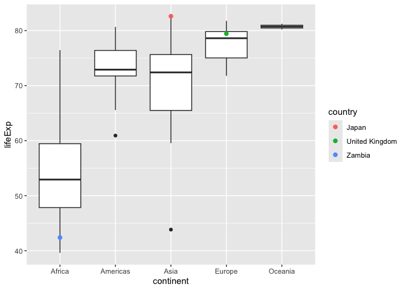

Gapminder
================
(Your name here)
2020-

- [Grading Rubric](#grading-rubric)
  - [Individual](#individual)
  - [Submission](#submission)
- [Guided EDA](#guided-eda)
  - [**q0** Perform your “first checks” on the dataset. What variables
    are in
    this](#q0-perform-your-first-checks-on-the-dataset-what-variables-are-in-this)
  - [**q1** Determine the most and least recent years in the `gapminder`
    dataset.](#q1-determine-the-most-and-least-recent-years-in-the-gapminder-dataset)
  - [**q2** Filter on years matching `year_min`, and make a plot of the
    GDP per capita against continent. Choose an appropriate `geom_` to
    visualize the data. What observations can you
    make?](#q2-filter-on-years-matching-year_min-and-make-a-plot-of-the-gdp-per-capita-against-continent-choose-an-appropriate-geom_-to-visualize-the-data-what-observations-can-you-make)
  - [**q3** You should have found *at least* three outliers in q2 (but
    possibly many more!). Identify those outliers (figure out which
    countries they
    are).](#q3-you-should-have-found-at-least-three-outliers-in-q2-but-possibly-many-more-identify-those-outliers-figure-out-which-countries-they-are)
  - [**q4** Create a plot similar to yours from q2 studying both
    `year_min` and `year_max`. Find a way to highlight the outliers from
    q3 on your plot *in a way that lets you identify which country is
    which*. Compare the patterns between `year_min` and
    `year_max`.](#q4-create-a-plot-similar-to-yours-from-q2-studying-both-year_min-and-year_max-find-a-way-to-highlight-the-outliers-from-q3-on-your-plot-in-a-way-that-lets-you-identify-which-country-is-which-compare-the-patterns-between-year_min-and-year_max)
- [Your Own EDA](#your-own-eda)
  - [**q5** Create *at least* three new figures below. With each figure,
    try to pose new questions about the
    data.](#q5-create-at-least-three-new-figures-below-with-each-figure-try-to-pose-new-questions-about-the-data)

*Purpose*: Learning to do EDA well takes practice! In this challenge
you’ll further practice EDA by first completing a guided exploration,
then by conducting your own investigation. This challenge will also give
you a chance to use the wide variety of visual tools we’ve been
learning.

<!-- include-rubric -->

# Grading Rubric

<!-- -------------------------------------------------- -->

Unlike exercises, **challenges will be graded**. The following rubrics
define how you will be graded, both on an individual and team basis.

## Individual

<!-- ------------------------- -->

| Category | Needs Improvement | Satisfactory |
|----|----|----|
| Effort | Some task **q**’s left unattempted | All task **q**’s attempted |
| Observed | Did not document observations, or observations incorrect | Documented correct observations based on analysis |
| Supported | Some observations not clearly supported by analysis | All observations clearly supported by analysis (table, graph, etc.) |
| Assessed | Observations include claims not supported by the data, or reflect a level of certainty not warranted by the data | Observations are appropriately qualified by the quality & relevance of the data and (in)conclusiveness of the support |
| Specified | Uses the phrase “more data are necessary” without clarification | Any statement that “more data are necessary” specifies which *specific* data are needed to answer what *specific* question |
| Code Styled | Violations of the [style guide](https://style.tidyverse.org/) hinder readability | Code sufficiently close to the [style guide](https://style.tidyverse.org/) |

## Submission

<!-- ------------------------- -->

Make sure to commit both the challenge report (`report.md` file) and
supporting files (`report_files/` folder) when you are done! Then submit
a link to Canvas. **Your Challenge submission is not complete without
all files uploaded to GitHub.**

``` r
library(tidyverse)
```

    ## ── Attaching core tidyverse packages ──────────────────────── tidyverse 2.0.0 ──
    ## ✔ dplyr     1.1.4     ✔ readr     2.1.5
    ## ✔ forcats   1.0.0     ✔ stringr   1.5.1
    ## ✔ ggplot2   3.5.1     ✔ tibble    3.2.1
    ## ✔ lubridate 1.9.3     ✔ tidyr     1.3.1
    ## ✔ purrr     1.0.2     
    ## ── Conflicts ────────────────────────────────────────── tidyverse_conflicts() ──
    ## ✖ dplyr::filter() masks stats::filter()
    ## ✖ dplyr::lag()    masks stats::lag()
    ## ℹ Use the conflicted package (<http://conflicted.r-lib.org/>) to force all conflicts to become errors

``` r
library(gapminder)
```

*Background*: [Gapminder](https://www.gapminder.org/about-gapminder/) is
an independent organization that seeks to educate people about the state
of the world. They seek to counteract the worldview constructed by a
hype-driven media cycle, and promote a “fact-based worldview” by
focusing on data. The dataset we’ll study in this challenge is from
Gapminder.

# Guided EDA

<!-- -------------------------------------------------- -->

First, we’ll go through a round of *guided EDA*. Try to pay attention to
the high-level process we’re going through—after this guided round
you’ll be responsible for doing another cycle of EDA on your own!

### **q0** Perform your “first checks” on the dataset. What variables are in this

dataset?

``` r
## TASK: Do your "first checks" here!
# glimpse(gapminder)
gapminder
```

    ## # A tibble: 1,704 × 6
    ##    country     continent  year lifeExp      pop gdpPercap
    ##    <fct>       <fct>     <int>   <dbl>    <int>     <dbl>
    ##  1 Afghanistan Asia       1952    28.8  8425333      779.
    ##  2 Afghanistan Asia       1957    30.3  9240934      821.
    ##  3 Afghanistan Asia       1962    32.0 10267083      853.
    ##  4 Afghanistan Asia       1967    34.0 11537966      836.
    ##  5 Afghanistan Asia       1972    36.1 13079460      740.
    ##  6 Afghanistan Asia       1977    38.4 14880372      786.
    ##  7 Afghanistan Asia       1982    39.9 12881816      978.
    ##  8 Afghanistan Asia       1987    40.8 13867957      852.
    ##  9 Afghanistan Asia       1992    41.7 16317921      649.
    ## 10 Afghanistan Asia       1997    41.8 22227415      635.
    ## # ℹ 1,694 more rows

**Observations**:

- Write all variable names here

country continent year lifeExp pop gdpPercap

### **q1** Determine the most and least recent years in the `gapminder` dataset.

*Hint*: Use the `pull()` function to get a vector out of a tibble.
(Rather than the `$` notation of base R.)

``` r
## TASK: Find the largest and smallest values of `year` in `gapminder`
year_max <- gapminder %>% pull(year) %>% max()
year_min <- gapminder %>% pull(year) %>% min()
```

Use the following test to check your work.

``` r
## NOTE: No need to change this
assertthat::assert_that(year_max %% 7 == 5)
```

    ## [1] TRUE

``` r
assertthat::assert_that(year_max %% 3 == 0)
```

    ## [1] TRUE

``` r
assertthat::assert_that(year_min %% 7 == 6)
```

    ## [1] TRUE

``` r
assertthat::assert_that(year_min %% 3 == 2)
```

    ## [1] TRUE

``` r
if (is_tibble(year_max)) {
  print("year_max is a tibble; try using `pull()` to get a vector")
  assertthat::assert_that(False)
}

print("Nice!")
```

    ## [1] "Nice!"

### **q2** Filter on years matching `year_min`, and make a plot of the GDP per capita against continent. Choose an appropriate `geom_` to visualize the data. What observations can you make?

You may encounter difficulties in visualizing these data; if so document
your challenges and attempt to produce the most informative visual you
can.

``` r
## TASK: Create a visual of gdpPercap vs continent
gapminder_1952 <- gapminder %>% filter(year == year_min)

ggplot(gapminder_1952, aes(x = continent, y = gdpPercap)) +
  geom_boxplot() +
  labs(title = "GDP per Capita by Continent (1952)",
       x = "Continent",
       y = "GDP per Capita") +
  theme_minimal()
```

<!-- -->

``` r
outlier <- gapminder %>% filter(year == year_min) %>% filter(gdpPercap >= 30000)
print(outlier)
```

    ## # A tibble: 1 × 6
    ##   country continent  year lifeExp    pop gdpPercap
    ##   <fct>   <fct>     <int>   <dbl>  <int>     <dbl>
    ## 1 Kuwait  Asia       1952    55.6 160000   108382.

``` r
gapminder_1952 <- gapminder %>% filter(year == year_min) %>% filter(gdpPercap <= 30000)

ggplot(gapminder_1952, aes(x = continent, y = gdpPercap)) +
  geom_boxplot() +
  labs(title = "GDP per Capita by Continent (1952)",
       x = "Continent",
       y = "GDP per Capita") +
  theme_minimal()
```

<!-- -->

``` r
library(maps)
```

    ## 
    ## Attaching package: 'maps'

    ## The following object is masked from 'package:purrr':
    ## 
    ##     map

``` r
world_map <- map_data("world")

# Adjust country names to match between gapminder and world map data
gapminder_1952 <- gapminder_1952 %>%
  mutate(country = case_when(
    country == "United States" ~ "USA",
    country == "United Kingdom" ~ "UK",
    country == "Congo, Dem. Rep." ~ "Democratic Republic of the Congo",
    country == "Congo, Rep." ~ "Republic of Congo",
    country == "Korea, Dem. Rep." ~ "North Korea",
    country == "Korea, Rep." ~ "South Korea",
    country == "Russian Federation" ~ "Russia",  
    country == "Soviet Union" ~ "Russia",        
    TRUE ~ as.character(country)
  ))

# Merge gapminder data with world map data
map_data <- world_map %>%
  left_join(gapminder_1952, by = c("region" = "country"))

ggplot(map_data, aes(x = long, y = lat, group = group, fill = gdpPercap)) +
  geom_polygon(color = "white", size = 0.1) +
  scale_fill_gradient(low = "lightblue", high = "darkblue", na.value = "gray", name = "GDP per Capita") +
  labs(title = "GDP per Capita by Country (1952)",
       subtitle = "Data from Gapminder",
       caption = "Gray areas indicate missing data") +
  theme_minimal() +
  theme(axis.text = element_blank(),
        axis.title = element_blank(),
        axis.ticks = element_blank(),
        panel.grid = element_blank())
```

    ## Warning: Using `size` aesthetic for lines was deprecated in ggplot2 3.4.0.
    ## ℹ Please use `linewidth` instead.
    ## This warning is displayed once every 8 hours.
    ## Call `lifecycle::last_lifecycle_warnings()` to see where this warning was
    ## generated.

<!-- -->

**Observations**:

- Plotting it as a map, I see that a high concentration of countries in
  Oceania, Europe, and North America had a very high GDP. This aligns
  with the box plot. We also see from the map view that we might be
  missing quite a few countries from this dataset. In particular, Russia
  might be a big game changer for Europe’s GDP.

**Difficulties & Approaches**:

- Unedited graph of data was very hard to read because of one specific
  outlier from Asia. -\> I removed the outlier from the visualization. I
  also printed the outlier to inspect which country it is from. The
  country is Kuwait. According to Wikipedia, “By 1952, the country
  became the largest oil exporter in the Persian Gulf. This massive
  growth attracted many foreign workers, especially from Palestine,
  Egypt, Iran, and India.” However, Kuwait was still a British
  protectorate at that time. The country was not independent until 1961.
  So, the data is not very reliable. I removed the outlier from the
  visualization.

### **q3** You should have found *at least* three outliers in q2 (but possibly many more!). Identify those outliers (figure out which countries they are).

``` r
## TASK: Identify the outliers from q2

# Bring back outliers
gapminder_1952 <- gapminder %>% filter(year == year_min)

outliers_1952 <- gapminder_1952 %>%
  group_by(continent) %>%
  filter(gdpPercap > quantile(gdpPercap, 0.75) + 1.5 * IQR(gdpPercap))

outliers_1952
```

    ## # A tibble: 9 × 6
    ## # Groups:   continent [4]
    ##   country       continent  year lifeExp       pop gdpPercap
    ##   <fct>         <fct>     <int>   <dbl>     <int>     <dbl>
    ## 1 Angola        Africa     1952    30.0   4232095     3521.
    ## 2 Bahrain       Asia       1952    50.9    120447     9867.
    ## 3 Canada        Americas   1952    68.8  14785584    11367.
    ## 4 Gabon         Africa     1952    37.0    420702     4293.
    ## 5 Kuwait        Asia       1952    55.6    160000   108382.
    ## 6 South Africa  Africa     1952    45.0  14264935     4725.
    ## 7 Switzerland   Europe     1952    69.6   4815000    14734.
    ## 8 United States Americas   1952    68.4 157553000    13990.
    ## 9 Venezuela     Americas   1952    55.1   5439568     7690.

**Observations**:

- Identify the outlier countries from q2
  - Angola
  - Bahrain
  - Canada
  - Gabon
  - Kuwait
  - South Africa
  - Switzerland
  - United States Americas
  - Venezuela

*Hint*: For the next task, it’s helpful to know a ggplot trick we’ll
learn in an upcoming exercise: You can use the `data` argument inside
any `geom_*` to modify the data that will be plotted *by that geom
only*. For instance, you can use this trick to filter a set of points to
label:

``` r
## NOTE: No need to edit, use ideas from this in q4 below
gapminder %>%
  filter(year == max(year)) %>%

  ggplot(aes(continent, lifeExp)) +
  geom_boxplot() +
  geom_point(
    data = . %>% filter(country %in% c("United Kingdom", "Japan", "Zambia")),
    mapping = aes(color = country),
    size = 2
  )
```

<!-- -->

### **q4** Create a plot similar to yours from q2 studying both `year_min` and `year_max`. Find a way to highlight the outliers from q3 on your plot *in a way that lets you identify which country is which*. Compare the patterns between `year_min` and `year_max`.

*Hint*: We’ve learned a lot of different ways to show multiple
variables; think about using different aesthetics or facets.

``` r
## TASK: Create a visual of gdpPercap vs continent
```

**Observations**:

- Write your observations here

# Your Own EDA

<!-- -------------------------------------------------- -->

Now it’s your turn! We just went through guided EDA considering the GDP
per capita at two time points. You can continue looking at outliers,
consider different years, repeat the exercise with `lifeExp`, consider
the relationship between variables, or something else entirely.

### **q5** Create *at least* three new figures below. With each figure, try to pose new questions about the data.

``` r
gapminder_2007 <- gapminder %>% filter(year == year_max)

# Plot life expectancy vs GDP per capita
ggplot(gapminder_2007, aes(x = gdpPercap, y = lifeExp)) +
  geom_point(aes(color = continent), size = 3, alpha = 0.7) +
  labs(title = "Life Expectancy vs GDP per Capita (2007)",
       x = "GDP per Capita",
       y = "Life Expectancy",
       color = "Continent") +
  theme_minimal()
```

<!-- -->

- It seems that there is an exponential return for life expectancy as
  GDP per capita increases. However, it seems that there is a
  diminishing return at gdp of around 20,000. After that point, the life
  expectancy does not increase as much with increasing gdp. This is
  especially true for countries in Europe and North America. It also
  seems that many of the continents have a similar life expectancy. It
  is also important to note that except one country in Asia, all
  reported countries with a life expectancy of below 55 are in Africa.

``` r
## TASK: Your second graph
gapminder_pop <- gapminder %>%
  group_by(continent, year) %>%
  summarize(total_pop = sum(pop), .groups = 'drop')

# Plot population growth over time
ggplot(gapminder_pop, aes(x = year, y = total_pop, color = continent)) +
  geom_line(size = 1.2) +
  labs(title = "Population Growth Over Time by Continent",
       x = "Year",
       y = "Total Population",
       color = "Continent") +
  theme_minimal()
```

<!-- -->

- While almost all countries have some form of growth in terms of
  population, Oceania and Europe had the least growth. On the other
  hand, Asia’s population grew the most, with a steady and steep
  increase. Africa’s population also grew significantly.

``` r
# Filter out Kuwait from the 1952 data
gapminder_1952 <- gapminder_1952 %>% filter(country != "Kuwait")

# Top 5 countries by GDP per capita in 1952 (excluding Kuwait)
top_5 <- gapminder_1952 %>%
  arrange(desc(gdpPercap)) %>%
  slice(1:5)

# Bottom 5 countries by GDP per capita in 1952
bottom_5 <- gapminder_1952 %>%
  arrange(gdpPercap) %>%
  slice(1:5)

# Combine the top and bottom 5 countries
top_5_countries <- top_5 %>% pull(country)
bottom_5_countries <- bottom_5 %>% pull(country)

# Filter the full dataset for top and bottom 5 countries
gapminder_top_5 <- gapminder %>% filter(country %in% top_5_countries)
gapminder_bottom_5 <- gapminder %>% filter(country %in% bottom_5_countries)
gapminder_top_5 <- gapminder_top_5 %>% mutate(group = "Top 5")
gapminder_bottom_5 <- gapminder_bottom_5 %>% mutate(group = "Bottom 5")
combined_data <- bind_rows(gapminder_top_5, gapminder_bottom_5)

ggplot(combined_data, aes(x = year, y = gdpPercap, color = country)) +
  geom_line(size = 1.2) +
  geom_point(size = 2) +
  facet_wrap(~ group, ncol = 1, scales = "free_y") +  # Stack vertically
  labs(title = "GDP per Capita Trends: Top 5 vs Bottom 5 Countries in 1952 (Excluding Kuwait)",
       x = "Year",
       y = "GDP per Capita",
       color = "Country") +
  theme_minimal() +
  theme(legend.position = "bottom")
```

<!-- --> It
seems that all of the countries grew in terms of gdp per capita. I
expected to see a downturn for some countries, however, it seems
everyone is growing. However, it is important to note that the scale of
growth is very different.

``` r
# Normalize GDP per capita to 1952 values
combined_data_normalized <- combined_data %>%
  group_by(country) %>%
  mutate(gdpPercap_normalized = gdpPercap / gdpPercap[year == 1952] * 100) %>%
  ungroup()

# Calculate average normalized GDP per capita for top 5 and bottom 5
average_data <- combined_data_normalized %>%
  group_by(group, year) %>%
  summarize(avg_gdpPercap_normalized = mean(gdpPercap_normalized, na.rm = TRUE), .groups = "drop")

# Plot the averages on the same graph
ggplot(average_data, aes(x = year, y = avg_gdpPercap_normalized, color = group)) +
  geom_line(size = 1.2) +
  geom_point(size = 2) +
  labs(title = "Average Normalized GDP per Capita Trends: Top 5 vs Bottom 5",
       x = "Year",
       y = "Average GDP per Capita (Normalized to 1952 = 100)",
       color = "Group") +
  theme_minimal() +
  theme(legend.position = "bottom")
```

<!-- --> -
While I expected more difference, it seems that after normalising, their
growth is very similar. The top 5 countries are still growing faster
than the bottom 5, especially but the difference is not as stark as I
expected.
