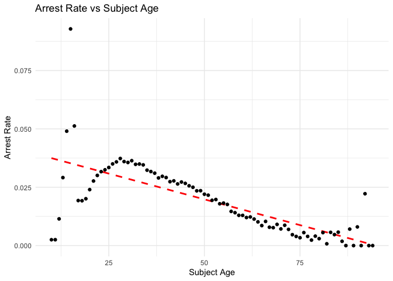
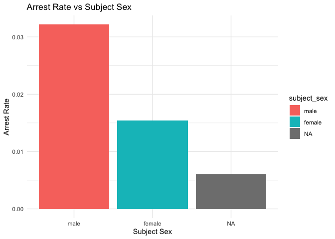
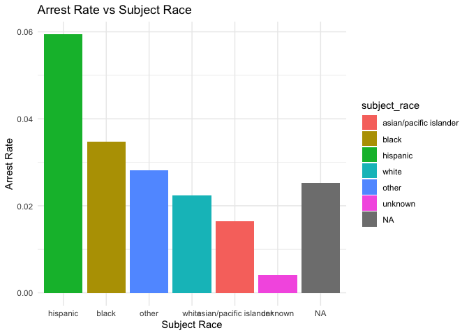

Massachusetts Highway Stops
================
Dakota Chang
2025-04-25

- [Grading Rubric](#grading-rubric)
  - [Individual](#individual)
  - [Submission](#submission)
- [Setup](#setup)
  - [**q1** Go to the Stanford Open Policing Project page and download
    the Massachusetts State Police records in `Rds` format. Move the
    data to your `data` folder and match the `filename` to load the
    data.](#q1-go-to-the-stanford-open-policing-project-page-and-download-the-massachusetts-state-police-records-in-rds-format-move-the-data-to-your-data-folder-and-match-the-filename-to-load-the-data)
- [EDA](#eda)
  - [**q2** Do your “first checks” on the dataset. What are the basic
    facts about this
    dataset?](#q2-do-your-first-checks-on-the-dataset-what-are-the-basic-facts-about-this-dataset)
  - [**q3** Check the set of factor levels for `subject_race` and
    `raw_Race`. What do you note about overlap / difference between the
    two
    sets?](#q3-check-the-set-of-factor-levels-for-subject_race-and-raw_race-what-do-you-note-about-overlap--difference-between-the-two-sets)
  - [**q4** Check whether `subject_race` and `raw_Race` match for a
    large fraction of cases. Which of the two hypotheses above is most
    likely, based on your
    results?](#q4-check-whether-subject_race-and-raw_race-match-for-a-large-fraction-of-cases-which-of-the-two-hypotheses-above-is-most-likely-based-on-your-results)
  - [Vis](#vis)
    - [**q5** Compare the *arrest rate*—the fraction of total cases in
      which the subject was arrested—across different factors. Create as
      many visuals (or tables) as you need, but make sure to check the
      trends across all of the `subject` variables. Answer the questions
      under *observations*
      below.](#q5-compare-the-arrest-ratethe-fraction-of-total-cases-in-which-the-subject-was-arrestedacross-different-factors-create-as-many-visuals-or-tables-as-you-need-but-make-sure-to-check-the-trends-across-all-of-the-subject-variables-answer-the-questions-under-observations-below)
- [Modeling](#modeling)
  - [**q6** Run the following code and interpret the regression
    coefficients. Answer the the questions under *observations*
    below.](#q6-run-the-following-code-and-interpret-the-regression-coefficients-answer-the-the-questions-under-observations-below)
  - [**q7** Re-fit the logistic regression from q6 setting `"white"` as
    the reference level for `subject_race`. Interpret the the model
    terms and answer the questions
    below.](#q7-re-fit-the-logistic-regression-from-q6-setting-white-as-the-reference-level-for-subject_race-interpret-the-the-model-terms-and-answer-the-questions-below)
  - [**q8** Re-fit the model using a factor indicating the presence of
    contraband in the subject’s vehicle. Answer the questions under
    *observations*
    below.](#q8-re-fit-the-model-using-a-factor-indicating-the-presence-of-contraband-in-the-subjects-vehicle-answer-the-questions-under-observations-below)
  - [**q9** Go deeper: Pose at least one more question about the data
    and fit at least one more model in support of answering that
    question.](#q9-go-deeper-pose-at-least-one-more-question-about-the-data-and-fit-at-least-one-more-model-in-support-of-answering-that-question)
  - [Further Reading](#further-reading)

*Purpose*: In this last challenge we’ll focus on using logistic
regression to study a large, complicated dataset. Interpreting the
results of a model can be challenging—both in terms of the statistics
and the real-world reasoning—so we’ll get some practice in this
challenge.

<!-- include-rubric -->

# Grading Rubric

<!-- -------------------------------------------------- -->

Unlike exercises, **challenges will be graded**. The following rubrics
define how you will be graded, both on an individual and team basis.

## Individual

<!-- ------------------------- -->

| Category | Needs Improvement | Satisfactory |
|----|----|----|
| Effort | Some task **q**’s left unattempted | All task **q**’s attempted |
| Observed | Did not document observations, or observations incorrect | Documented correct observations based on analysis |
| Supported | Some observations not clearly supported by analysis | All observations clearly supported by analysis (table, graph, etc.) |
| Assessed | Observations include claims not supported by the data, or reflect a level of certainty not warranted by the data | Observations are appropriately qualified by the quality & relevance of the data and (in)conclusiveness of the support |
| Specified | Uses the phrase “more data are necessary” without clarification | Any statement that “more data are necessary” specifies which *specific* data are needed to answer what *specific* question |
| Code Styled | Violations of the [style guide](https://style.tidyverse.org/) hinder readability | Code sufficiently close to the [style guide](https://style.tidyverse.org/) |

## Submission

<!-- ------------------------- -->

Make sure to commit both the challenge report (`report.md` file) and
supporting files (`report_files/` folder) when you are done! Then submit
a link to Canvas. **Your Challenge submission is not complete without
all files uploaded to GitHub.**

*Background*: We’ll study data from the [Stanford Open Policing
Project](https://openpolicing.stanford.edu/data/), specifically their
dataset on Massachusetts State Patrol police stops.

``` r
library(tidyverse)
```

    ## ── Attaching core tidyverse packages ──────────────────────── tidyverse 2.0.0 ──
    ## ✔ dplyr     1.1.4     ✔ readr     2.1.5
    ## ✔ forcats   1.0.0     ✔ stringr   1.5.1
    ## ✔ ggplot2   3.5.1     ✔ tibble    3.2.1
    ## ✔ lubridate 1.9.3     ✔ tidyr     1.3.1
    ## ✔ purrr     1.0.2     
    ## ── Conflicts ────────────────────────────────────────── tidyverse_conflicts() ──
    ## ✖ dplyr::filter() masks stats::filter()
    ## ✖ dplyr::lag()    masks stats::lag()
    ## ℹ Use the conflicted package (<http://conflicted.r-lib.org/>) to force all conflicts to become errors

``` r
library(broom)
```

# Setup

<!-- -------------------------------------------------- -->

### **q1** Go to the [Stanford Open Policing Project](https://openpolicing.stanford.edu/data/) page and download the Massachusetts State Police records in `Rds` format. Move the data to your `data` folder and match the `filename` to load the data.

*Note*: An `Rds` file is an R-specific file format. The function
`readRDS` will read these files.

``` r
## TODO: Download the data, move to your data folder, and load it
filename <- '/Users/dakotachang/Desktop/school/2425Spring/DataScience/data-science-S2025/challenges/data/yg821jf8611_ma_statewide_2020_04_01.rds'
df_data <- readRDS(filename)
```

# EDA

<!-- -------------------------------------------------- -->

### **q2** Do your “first checks” on the dataset. What are the basic facts about this dataset?

``` r
df_data %>% glimpse()
```

    ## Rows: 3,416,238
    ## Columns: 24
    ## $ raw_row_number             <chr> "1", "2", "3", "4", "5", "6", "7", "8", "9"…
    ## $ date                       <date> 2007-06-06, 2007-06-07, 2007-06-07, 2007-0…
    ## $ location                   <chr> "MIDDLEBOROUGH", "SEEKONK", "MEDFORD", "MED…
    ## $ county_name                <chr> "Plymouth County", "Bristol County", "Middl…
    ## $ subject_age                <int> 33, 36, 56, 37, 22, 34, 54, 31, 21, 56, 56,…
    ## $ subject_race               <fct> white, white, white, white, hispanic, white…
    ## $ subject_sex                <fct> male, male, female, male, female, male, mal…
    ## $ type                       <fct> vehicular, vehicular, vehicular, vehicular,…
    ## $ arrest_made                <lgl> FALSE, FALSE, FALSE, FALSE, FALSE, FALSE, F…
    ## $ citation_issued            <lgl> TRUE, FALSE, FALSE, FALSE, TRUE, TRUE, TRUE…
    ## $ warning_issued             <lgl> FALSE, TRUE, TRUE, TRUE, FALSE, FALSE, FALS…
    ## $ outcome                    <fct> citation, warning, warning, warning, citati…
    ## $ contraband_found           <lgl> NA, FALSE, NA, NA, NA, NA, NA, NA, NA, NA, …
    ## $ contraband_drugs           <lgl> NA, FALSE, NA, NA, NA, NA, NA, NA, NA, NA, …
    ## $ contraband_weapons         <lgl> NA, FALSE, NA, NA, NA, NA, NA, NA, NA, NA, …
    ## $ contraband_alcohol         <lgl> FALSE, FALSE, FALSE, FALSE, FALSE, FALSE, F…
    ## $ contraband_other           <lgl> NA, FALSE, NA, NA, NA, NA, NA, NA, NA, NA, …
    ## $ frisk_performed            <lgl> NA, FALSE, NA, NA, NA, NA, NA, NA, NA, NA, …
    ## $ search_conducted           <lgl> FALSE, TRUE, FALSE, FALSE, FALSE, FALSE, FA…
    ## $ search_basis               <fct> NA, other, NA, NA, NA, NA, NA, NA, NA, NA, …
    ## $ reason_for_stop            <chr> "Speed", NA, NA, NA, NA, "Speed", NA, NA, N…
    ## $ vehicle_type               <chr> "Passenger", "Commercial", "Passenger", "Co…
    ## $ vehicle_registration_state <fct> MA, MA, MA, MA, MA, MA, MA, MA, MA, MA, MA,…
    ## $ raw_Race                   <chr> "White", "White", "White", "White", "Hispan…

``` r
df_data %>% summary()
```

    ##  raw_row_number          date              location         county_name       
    ##  Length:3416238     Min.   :2007-01-01   Length:3416238     Length:3416238    
    ##  Class :character   1st Qu.:2009-04-22   Class :character   Class :character  
    ##  Mode  :character   Median :2011-07-08   Mode  :character   Mode  :character  
    ##                     Mean   :2011-07-16                                        
    ##                     3rd Qu.:2013-08-27                                        
    ##                     Max.   :2015-12-31                                        
    ##                                                                               
    ##   subject_age                     subject_race     subject_sex     
    ##  Min.   :10.00    asian/pacific islander: 166842   male  :2362238  
    ##  1st Qu.:25.00    black                 : 351610   female:1038377  
    ##  Median :34.00    hispanic              : 338317   NA's  :  15623  
    ##  Mean   :36.47    white                 :2529780                   
    ##  3rd Qu.:46.00    other                 :  11008                   
    ##  Max.   :94.00    unknown               :  17017                   
    ##  NA's   :158006   NA's                  :   1664                   
    ##          type         arrest_made     citation_issued warning_issued 
    ##  pedestrian:      0   Mode :logical   Mode :logical   Mode :logical  
    ##  vehicular :3416238   FALSE:3323303   FALSE:1244039   FALSE:2269244  
    ##                       TRUE :92019     TRUE :2171283   TRUE :1146078  
    ##                       NA's :916       NA's :916       NA's :916      
    ##                                                                      
    ##                                                                      
    ##                                                                      
    ##      outcome        contraband_found contraband_drugs contraband_weapons
    ##  warning :1146078   Mode :logical    Mode :logical    Mode :logical     
    ##  citation:2171283   FALSE:28256      FALSE:36296      FALSE:53237       
    ##  summons :      0   TRUE :27474      TRUE :19434      TRUE :2493        
    ##  arrest  :  92019   NA's :3360508    NA's :3360508    NA's :3360508     
    ##  NA's    :   6858                                                       
    ##                                                                         
    ##                                                                         
    ##  contraband_alcohol contraband_other frisk_performed search_conducted
    ##  Mode :logical      Mode :logical    Mode :logical   Mode :logical   
    ##  FALSE:3400070      FALSE:51708      FALSE:51029     FALSE:3360508   
    ##  TRUE :16168        TRUE :4022       TRUE :3602      TRUE :55730     
    ##                     NA's :3360508    NA's :3361607                   
    ##                                                                      
    ##                                                                      
    ##                                                                      
    ##          search_basis     reason_for_stop    vehicle_type      
    ##  k9            :      0   Length:3416238     Length:3416238    
    ##  plain view    :      0   Class :character   Class :character  
    ##  consent       :   6903   Mode  :character   Mode  :character  
    ##  probable cause:  25898                                        
    ##  other         :  18228                                        
    ##  NA's          :3365209                                        
    ##                                                                
    ##  vehicle_registration_state   raw_Race        
    ##  MA     :3053713            Length:3416238    
    ##  CT     :  82906            Class :character  
    ##  NY     :  69059            Mode  :character  
    ##  NH     :  51514                              
    ##  RI     :  39375                              
    ##  (Other): 109857                              
    ##  NA's   :   9814

``` r
df_data %>% sapply(n_distinct)
```

    ##             raw_row_number                       date 
    ##                    3416238                       3287 
    ##                   location                county_name 
    ##                        351                         15 
    ##                subject_age               subject_race 
    ##                         86                          7 
    ##                subject_sex                       type 
    ##                          3                          1 
    ##                arrest_made            citation_issued 
    ##                          3                          3 
    ##             warning_issued                    outcome 
    ##                          3                          4 
    ##           contraband_found           contraband_drugs 
    ##                          3                          3 
    ##         contraband_weapons         contraband_alcohol 
    ##                          3                          2 
    ##           contraband_other            frisk_performed 
    ##                          3                          3 
    ##           search_conducted               search_basis 
    ##                          2                          4 
    ##            reason_for_stop               vehicle_type 
    ##                          8                          8 
    ## vehicle_registration_state                   raw_Race 
    ##                         52                          9

``` r
sapply(df_data, function(x) sum(is.na(x))) 
```

    ##             raw_row_number                       date 
    ##                          0                          0 
    ##                   location                county_name 
    ##                       6666                       6666 
    ##                subject_age               subject_race 
    ##                     158006                       1664 
    ##                subject_sex                       type 
    ##                      15623                          0 
    ##                arrest_made            citation_issued 
    ##                        916                        916 
    ##             warning_issued                    outcome 
    ##                        916                       6858 
    ##           contraband_found           contraband_drugs 
    ##                    3360508                    3360508 
    ##         contraband_weapons         contraband_alcohol 
    ##                    3360508                          0 
    ##           contraband_other            frisk_performed 
    ##                    3360508                    3361607 
    ##           search_conducted               search_basis 
    ##                          0                    3365209 
    ##            reason_for_stop               vehicle_type 
    ##                    1659589                       4963 
    ## vehicle_registration_state                   raw_Race 
    ##                       9814                       1664

**Observations**:

- What are the basic facts about this dataset?
- It has 3,416,238 rows and 24 columns.
- There are many NA for contraband\_\* and reason_for_stop columns.
- There are not less than 10 unique values for most of the columns, with
  the exception of subject_age, vehicle_registration_state (which has
  52, 2 more than the 50 states), data, location, county_name, and
  raw_row_number.

Note that we have both a `subject_race` and `race_Raw` column. There are
a few possibilities as to what `race_Raw` represents:

- `race_Raw` could be the race of the police officer in the stop
- `race_Raw` could be an unprocessed version of `subject_race`

Let’s try to distinguish between these two possibilities.

### **q3** Check the set of factor levels for `subject_race` and `raw_Race`. What do you note about overlap / difference between the two sets?

``` r
## TODO: Determine the factor levels for subject_race and raw_Race
subject_race <- df_data %>% pull(subject_race)
raw_race <- df_data %>% pull(raw_Race)

df_data %>% 
  distinct(subject_race)
```

    ## # A tibble: 7 × 1
    ##   subject_race          
    ##   <fct>                 
    ## 1 white                 
    ## 2 hispanic              
    ## 3 black                 
    ## 4 asian/pacific islander
    ## 5 other                 
    ## 6 <NA>                  
    ## 7 unknown

``` r
df_data %>% 
  distinct(raw_Race)
```

    ## # A tibble: 9 × 1
    ##   raw_Race                                     
    ##   <chr>                                        
    ## 1 White                                        
    ## 2 Hispanic                                     
    ## 3 Black                                        
    ## 4 Asian or Pacific Islander                    
    ## 5 Middle Eastern or East Indian (South Asian)  
    ## 6 American Indian or Alaskan Native            
    ## 7 <NA>                                         
    ## 8 None - for no operator present citations only
    ## 9 A

**Observations**:

- What are the unique values for `subject_race`?

- white, hispanic, black, asian/pacific islander, other, unknown, NA

- What are the unique values for `raw_Race`?

- White, Hispanic, Black, Asian or Pacific Islander , Middle Eastern or
  East Indian (South Asian), American Indian or Alaskan Native, None -
  for no operator present citations only , A, NA

- What is the overlap between the two sets?

- If we ignore punctuation, the overlap is that both have white,
  hispanic, black, asian or pacific islander, and NA.

- What is the difference between the two sets?

- There are differences in punctuation, grouping, and capitalisation.
  `raw_Race` also has a category called A, which can be attributed to
  misprint. Middle Eastern or East Indian (South Asian) is not present
  in `subject_race`, and `raw_Race` has a category for American Indian
  or Alaskan Native, which is not present in `subject_race`.

### **q4** Check whether `subject_race` and `raw_Race` match for a large fraction of cases. Which of the two hypotheses above is most likely, based on your results?

*Note*: Just to be clear, I’m *not* asking you to do a *statistical*
hypothesis test.

``` r
## TODO: Devise your own way to test the hypothesis posed above.

df_race_compare <- df_data %>%
  mutate(
    # Standardize subject_race (already fairly clean)
    subject_race_clean = tolower(as.character(subject_race)),
    
    # Clean raw_Race to match subject_race categories
    raw_race_clean = case_when(
      str_to_lower(raw_Race) == "white" ~ "white",
      str_to_lower(raw_Race) == "hispanic" ~ "hispanic",
      str_to_lower(raw_Race) == "black" ~ "black",
      str_to_lower(raw_Race) == "asian or pacific islander" ~ "asian/pacific islander",
      str_to_lower(raw_Race) == "middle eastern or east indian (south asian)" ~ "other",
      str_to_lower(raw_Race) == "american indian or alaskan native" ~ "other",
      str_to_lower(raw_Race) == "none - for no operator present citations only" ~ "unknown",
      str_to_lower(raw_Race) == "a" ~ NA_character_,
      is.na(raw_Race) ~ NA_character_,
      TRUE ~ "other"  # Catch-all for remaining cases
    )
  ) %>%
  # Remove rows where either race value is missing
  filter(!is.na(subject_race_clean), !is.na(raw_race_clean))

# Calculate overall match rate
match_results <- df_race_compare %>%
  summarise(
    total_comparisons = n(),
    matches = sum(subject_race_clean == raw_race_clean),
    match_rate = matches / total_comparisons
  )

match_results
```

    ## # A tibble: 1 × 3
    ##   total_comparisons matches match_rate
    ##               <int>   <int>      <dbl>
    ## 1           3414572 3350022      0.981

**Observations**

Between the two hypotheses:

- `race_Raw` could be the race of the police officer in the stop
- `race_Raw` could be an unprocessed version of `subject_race`

which is most plausible, based on your results?

- There is a very high matching rate (98.1%). Unless officers are
  disproportionately likely to pull over people of their race,
  `race_Raw` is most likely an unprocessed version of `subject_race`.

## Vis

<!-- ------------------------- -->

### **q5** Compare the *arrest rate*—the fraction of total cases in which the subject was arrested—across different factors. Create as many visuals (or tables) as you need, but make sure to check the trends across all of the `subject` variables. Answer the questions under *observations* below.

(Note: Create as many chunks and visuals as you need)

``` r
# arrest_rate vs subject_age

df_data %>%
  filter(!is.na(arrest_made)) %>%
  group_by(subject_age) %>%
  summarise(
    arrest_rate = mean(arrest_made, na.rm = TRUE)
  ) %>%
  ggplot(aes(x = subject_age, y = arrest_rate)) +
  geom_smooth(method = "lm", se = FALSE, color = "red", linetype = "dashed") +
  geom_point() +
  labs(title = "Arrest Rate vs Subject Age", x = "Subject Age", y = "Arrest Rate") +
  theme_minimal()
```

    ## `geom_smooth()` using formula = 'y ~ x'

    ## Warning: Removed 1 row containing non-finite outside the scale range
    ## (`stat_smooth()`).

    ## Warning: Removed 1 row containing missing values or values outside the scale range
    ## (`geom_point()`).

<!-- -->

``` r
# bar chart of arrest_rate vs subject_sex

df_data %>%
  filter(!is.na(arrest_made)) %>%
  group_by(subject_sex) %>%
  summarise(
    arrest_rate = mean(arrest_made, na.rm = TRUE)
  ) %>% 
  ggplot(aes(x = subject_sex, y = arrest_rate, fill = subject_sex)) +
  geom_bar(stat = "identity") +
  labs(title = "Arrest Rate vs Subject Sex", x = "Subject Sex", y = "Arrest Rate") +
  theme_minimal()
```

<!-- -->

``` r
# bar chart of arrest_rate vs subject_sex

df_data %>%
  filter(!is.na(arrest_made)) %>%
  group_by(subject_race) %>%
  summarise(
    arrest_rate = mean(arrest_made, na.rm = TRUE)
  ) %>% 
  ggplot(aes(x = reorder(subject_race, arrest_rate, decreasing=TRUE), y = arrest_rate, fill = subject_race)) +
  geom_bar(stat = "identity") +
  labs(title = "Arrest Rate vs Subject Race", x = "Subject Race", y = "Arrest Rate") +
  theme_minimal()
```

<!-- -->

**Observations**:

- How does `arrest_rate` tend to vary with `subject_age`?
  - There is an overall decreasing relationship for age vs arrest rate.
    However, there is a spike in the front and in the very end.
- How does `arrest_rate` tend to vary with `subject_sex`?
  - Male are disproportionately more likely to be arrested compared to
    females, at over 3% for males and 1.5% for females.
- How does `arrest_rate` tend to vary with `subject_race`?
  - Race is highly correlated with with arrest rates, with hispanic
    people getting arrested at almost 60% and black people getting
    arrested at over 30% being highest. Out of all the known races,
    asian/pacific islander is the least arrested.

# Modeling

<!-- -------------------------------------------------- -->

We’re going to use a model to study the relationship between `subject`
factors and arrest rate, but first we need to understand a bit more
about *dummy variables*

### **q6** Run the following code and interpret the regression coefficients. Answer the the questions under *observations* below.

``` r
## NOTE: No need to edit; inspect the estimated model terms.
fit_q6 <-
  glm(
    formula = arrest_made ~ subject_age + subject_race + subject_sex,
    data = df_data %>%
      filter(
        !is.na(arrest_made),
        subject_race %in% c("white", "black", "hispanic")
      ),
    family = "binomial"
  )

fit_q6 %>% tidy()
```

    ## # A tibble: 5 × 5
    ##   term                 estimate std.error statistic   p.value
    ##   <chr>                   <dbl>     <dbl>     <dbl>     <dbl>
    ## 1 (Intercept)           -2.67    0.0132      -202.  0        
    ## 2 subject_age           -0.0142  0.000280     -50.5 0        
    ## 3 subject_racehispanic   0.513   0.0119        43.3 0        
    ## 4 subject_racewhite     -0.380   0.0103       -37.0 3.12e-299
    ## 5 subject_sexfemale     -0.755   0.00910      -83.0 0

**Observations**:

- Which `subject_race` levels are included in fitting the model?
  - “white,” “black,” and “hispanic.”
- Which `subject_race` levels have terms in the model?
  - “Hispanic” and “white”. “black” is a reference category and not in
    the model.

You should find that each factor in the model has a level *missing* in
its set of terms. This is because R represents factors against a
*reference level*: The model treats one factor level as “default”, and
each factor model term represents a change from that “default” behavior.
For instance, the model above treats `subject_sex==male` as the
reference level, so the `subject_sexfemale` term represents the *change
in probability* of arrest due to a person being female (rather than
male).

The this reference level approach to coding factors is necessary for
[technical
reasons](https://www.andrew.cmu.edu/user/achoulde/94842/lectures/lecture10/lecture10-94842.html#why-is-one-of-the-levels-missing-in-the-regression),
but it complicates interpreting the model results. For instance; if we
want to compare two levels, neither of which are the reference level, we
have to consider the difference in their model coefficients. But if we
want to compare all levels against one “baseline” level, then we can
relevel the data to facilitate this comparison.

By default `glm` uses the first factor level present as the reference
level. Therefore we can use
`mutate(factor = fct_relevel(factor, "desired_level"))` to set our
`"desired_level"` as the reference factor.

### **q7** Re-fit the logistic regression from q6 setting `"white"` as the reference level for `subject_race`. Interpret the the model terms and answer the questions below.

``` r
## TODO: Re-fit the logistic regression, but set "white" as the reference
## level for subject_race

df_q7 <- df_data %>%
  filter(
    !is.na(arrest_made),
    subject_race %in% c("white", "black", "hispanic")
  ) %>%
  mutate(subject_race = relevel(factor(subject_race), ref = "white"))

fit_q7 <-
  glm(
    formula = arrest_made ~ subject_age + subject_race + subject_sex,
    data = df_q7 %>%
      filter(
        !is.na(arrest_made),
        subject_race %in% c("white", "black", "hispanic")
      ),
    family = "binomial"
  )

fit_q7 %>% tidy()
```

    ## # A tibble: 5 × 5
    ##   term                 estimate std.error statistic   p.value
    ##   <chr>                   <dbl>     <dbl>     <dbl>     <dbl>
    ## 1 (Intercept)           -3.05    0.0109      -279.  0        
    ## 2 subject_age           -0.0142  0.000280     -50.5 0        
    ## 3 subject_raceblack      0.380   0.0103        37.0 3.12e-299
    ## 4 subject_racehispanic   0.893   0.00859      104.  0        
    ## 5 subject_sexfemale     -0.755   0.00910      -83.0 0

**Observations**:

- Which `subject_race` level has the highest probability of being
  arrested, according to this model? Which has the lowest probability?
  - `Hispanic` has a highest probability, and `white` has the lowest
    probability.
- What could explain this difference in probabilities of arrest across
  race? List **multiple** possibilities.
  - Implicit/explicit bias of the police officer.
  - Overpolicing of certain communities.
  - Specific successful large-scale police operations that skewed the
    data.
- Look at the set of variables in the dataset; do any of the columns
  relate to a potential explanation you listed?
  - No.

One way we can explain differential arrest rates is to include some
measure indicating the presence of an arrestable offense. We’ll do this
in a particular way in the next task.

### **q8** Re-fit the model using a factor indicating the presence of contraband in the subject’s vehicle. Answer the questions under *observations* below.

``` r
## TODO: Repeat the modeling above, but control for whether contraband was found
## during the police stop

fit_q8 <- glm(
  arrest_made ~ subject_age + subject_race + subject_sex + contraband_found,
  data = df_q7,
  family = "binomial"
)

fit_q8 %>% tidy()
```

    ## # A tibble: 6 × 5
    ##   term                 estimate std.error statistic   p.value
    ##   <chr>                   <dbl>     <dbl>     <dbl>     <dbl>
    ## 1 (Intercept)           -1.72    0.0339      -50.8  0        
    ## 2 subject_age            0.0225  0.000866     26.0  2.19e-149
    ## 3 subject_raceblack     -0.0511  0.0270       -1.90 5.80e-  2
    ## 4 subject_racehispanic   0.221   0.0237        9.31 1.32e- 20
    ## 5 subject_sexfemale     -0.306   0.0257      -11.9  1.06e- 32
    ## 6 contraband_foundTRUE   0.609   0.0192       31.7  4.29e-221

**Observations**:

- How does controlling for found contraband affect the `subject_race`
  terms in the model?
  - When only looking at subject_race, `white` is least likely to be
    arrested. However, when controlling for contraband found, `black` is
    less likely to be arrested than `white`. Morever, `hispanic`
    arrested rate is reduced from 89% to 22%.
- What does the *finding of contraband* tell us about the stop? What
  does it *not* tell us about the stop?
  - It tells us that the car was searched. However, it does not tell us
    why it was searched, or whether the search was justified.

### **q9** Go deeper: Pose at least one more question about the data and fit at least one more model in support of answering that question.

Question

Do out of state plates invite more searches?

``` r
df_q9 <- df_data %>%
  mutate(
    out_of_state = vehicle_registration_state != "MA",
    out_of_state = factor(out_of_state, labels = c("MA", "Out-of-State"))
  ) %>%
  filter(!is.na(out_of_state), !is.na(search_conducted))

# Model 1: Simple relationship between plates and searches
fit_q9_simple <- glm(
  search_conducted ~ out_of_state,
  data = df_q9,
  family = "binomial"
)

# Model 2: Controlling for other factors
fit_q9_controlled <- glm(
  search_conducted ~ out_of_state + subject_race + subject_sex + subject_age,
  data = df_q9,
  family = "binomial"
)

fit_q9_simple %>% tidy
```

    ## # A tibble: 2 × 5
    ##   term                     estimate std.error statistic   p.value
    ##   <chr>                       <dbl>     <dbl>     <dbl>     <dbl>
    ## 1 (Intercept)                -4.06    0.00443    -916.  0        
    ## 2 out_of_stateOut-of-State   -0.425   0.0166      -25.5 1.03e-143

``` r
fit_q9_controlled %>% tidy()
```

    ## # A tibble: 9 × 5
    ##   term                     estimate std.error statistic   p.value
    ##   <chr>                       <dbl>     <dbl>     <dbl>     <dbl>
    ## 1 (Intercept)               -3.21    0.0288     -112.   0        
    ## 2 out_of_stateOut-of-State  -0.326   0.0168      -19.4  3.39e- 84
    ## 3 subject_raceblack          0.924   0.0281       32.9  6.00e-237
    ## 4 subject_racehispanic       1.15    0.0276       41.5  0        
    ## 5 subject_racewhite          0.474   0.0264       18.0  3.08e- 72
    ## 6 subject_raceother          1.13    0.0682       16.5  2.90e- 61
    ## 7 subject_raceunknown       -0.455   0.260        -1.75 8.00e-  2
    ## 8 subject_sexfemale         -0.728   0.0112      -64.8  0        
    ## 9 subject_age               -0.0376  0.000401    -93.9  0

**Observations**:

- According to the simple model, out of state plates are less likely to
  be searched. This could mean two things:
  1.  Out of state plates are less likely to be searched.
  2.  Out of state paltes are pulled over for less important reasons,
      and therefore less likely to be searched. When controlling for
      other factors, out of state plates still less likely to be
      searched, but at a smaller magnitude than the simple model.

## Further Reading

<!-- -------------------------------------------------- -->

- Stanford Open Policing Project
  [findings](https://openpolicing.stanford.edu/findings/).
